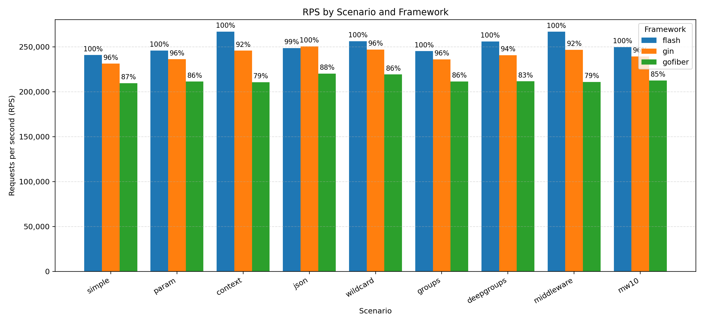
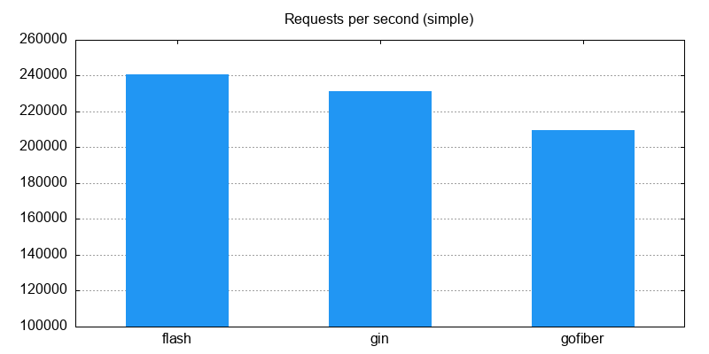
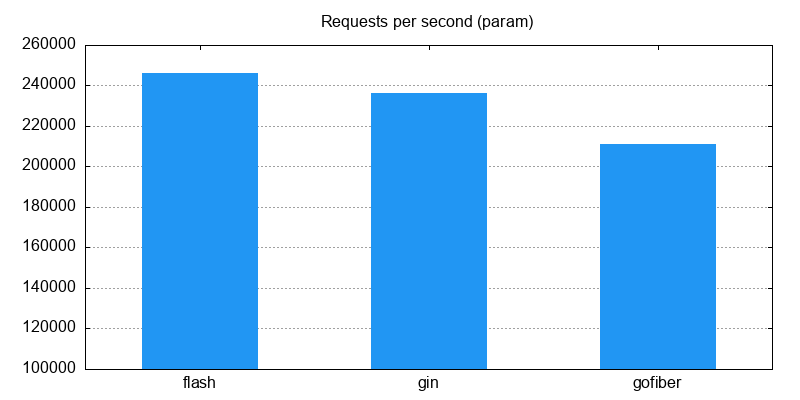
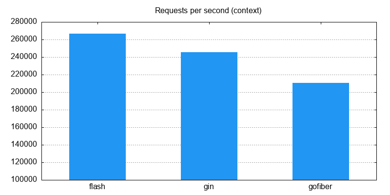
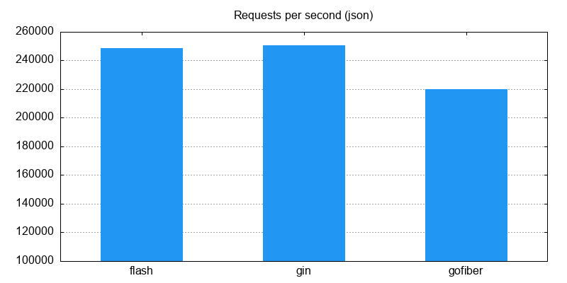
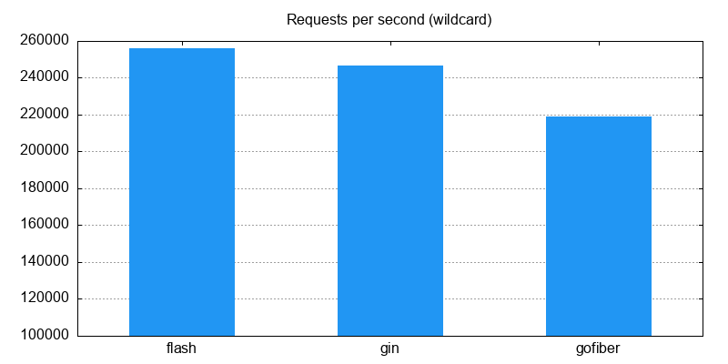
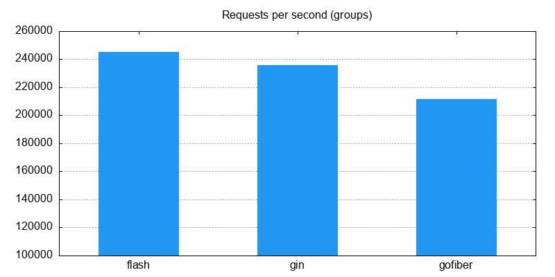
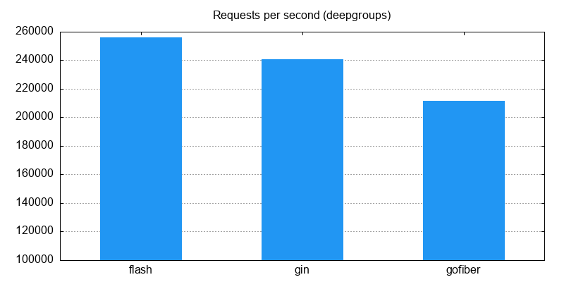
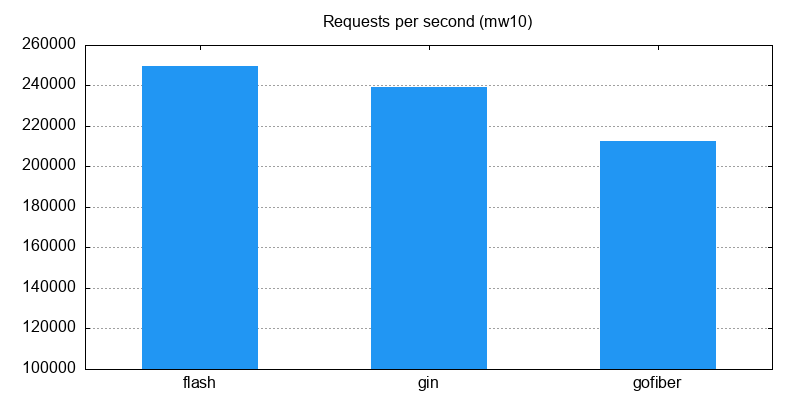

# ⚡ GoFlash Benchmarks

<div align="center">
  
  
  
  
</div>

<p align="center">
  <strong>🚀 Comprehensive performance benchmarking suite comparing GoFlash against Gin and Fiber.</strong>
</p>

---

## 📋 Table of Contents

- [🎯 Overview](#-overview)
- [🏗️ Framework Comparison](#️-framework-comparison)
- [📊 Benchmark Scenarios](#-benchmark-scenarios)
- [🧪 Test Environment](#-test-environment)
- [📈 Results](#-results)
- [🚀 Quick Start](#-quick-start)
- [⚙️ Configuration](#️-configuration)
- [📚 Documentation](#-documentation)
- [🤝 Contributing](#-contributing)

## 🎯 Overview

This repository contains a comprehensive benchmarking suite designed to evaluate the performance of **GoFlash** against other popular Go web frameworks. Our goal is to provide accurate, reproducible, and meaningful performance comparisons across various real-world scenarios.

### 🏆 Frameworks Under Test

| Framework     | Version   | Description                                      |
| ------------- | --------- | ------------------------------------------------ |
| **🔥 GoFlash** | Latest    | High-performance, minimalist Go web framework    |
| **🍸 Gin**     | Latest    | Fast HTTP web framework with martini-like API    |
| **🕷️ Fiber**   | v3 Beta 5 | Express-inspired web framework built on Fasthttp |

## 🏗️ Framework Comparison

### ⚡ Performance Characteristics

- **GoFlash**: Optimized for speed with minimal overhead
- **Gin**: Battle-tested with excellent middleware ecosystem
- **Fiber**: Express.js-like API with high performance

### 🎯 Use Case Alignment

Each framework excels in different scenarios, making this benchmark crucial for informed decision-making in your next Go project.

## 📊 Benchmark Scenarios

Our benchmark suite covers **9 comprehensive scenarios** that represent common web application patterns:

<details>
<summary><strong>📝 Click to expand scenario details</strong></summary>

| #   | Scenario               | Description                          | Real-world Impact              |
| --- | ---------------------- | ------------------------------------ | ------------------------------ |
| 1️⃣   | **Simple Ping/Pong**   | Basic endpoint response              | Foundation performance         |
| 2️⃣   | **URL Path Parameter** | Dynamic route parsing                | RESTful API endpoints          |
| 3️⃣   | **Request Context**    | Context read/write operations        | State management               |
| 4️⃣   | **JSON Binding**       | Request deserialization + validation | API data processing            |
| 5️⃣   | **Wildcard Routing**   | Trailing wildcard route matching     | File serving, catch-all routes |
| 6️⃣   | **Route Groups**       | Basic route organization             | API versioning                 |
| 7️⃣   | **Deep Route Groups**  | 10-level nested groups               | Complex routing hierarchies    |
| 8️⃣   | **Single Middleware**  | Basic middleware processing          | Authentication, logging        |
| 9️⃣   | **Middleware Chain**   | 10-middleware processing chain       | Complex request pipelines      |

</details>

## 🧪 Test Environment

### 🖥️ Hardware Specifications

- **Machine**: Apple MacBook Pro (M3 chip)
- **Memory**: 32 GB RAM
- **Architecture**: ARM64

### 🔧 Benchmarking Tools

- **Load Generator**: [wrk](https://github.com/wg/wrk) HTTP benchmarking tool
- **Threads**: 11 concurrent threads
- **Connections**: 256 concurrent connections
- **Protocol**: HTTP/1.1 with keep-alive

### 📐 Methodology

- ✅ Functionally equivalent handlers across all frameworks
- ✅ Production/release build settings enabled
- ✅ Consistent routing patterns and middleware implementation
- ✅ Multiple test runs for statistical significance
- ✅ Isolated server processes to prevent interference

> ⚠️ **Note**: Results are indicative and may vary based on workload, configuration, and environment. Always benchmark in your specific use case.

## 📈 Results

> 📊 **Complete dataset available**: Detailed CSV files and additional metrics can be found in the [`results/`](./results/) directory.

### 🏆 Performance Overview

Our comprehensive benchmarks reveal significant performance differences across frameworks and scenarios. Below are the key findings:

<div align="center">

### 📊 Cumulative Performance Comparison



*Higher bars indicate better performance (requests per second)*

</div>

---

### 📋 Detailed Scenario Results

<details>
<summary><strong>🎯 Simple Ping/Pong Endpoint</strong></summary>

**Test**: Basic HTTP GET response without any processing



**Key Insights**:

- Foundation performance comparison
- Measures framework overhead
- Critical for high-throughput applications

</details>

<details>
<summary><strong>🔗 URL Path Parameter Extraction</strong></summary>

**Test**: Dynamic route matching and parameter extraction (`/user/:id`)



**Key Insights**:

- RESTful API performance
- Router efficiency comparison
- Path parsing overhead analysis

</details>

<details>
<summary><strong>📝 Request Context Operations</strong></summary>

**Test**: Writing to and reading from request context



**Key Insights**:

- Context management efficiency
- State preservation performance
- Middleware communication overhead

</details>

<details>
<summary><strong>📦 JSON Binding & Validation</strong></summary>

**Test**: JSON request deserialization with struct binding and validation



**Key Insights**:

- API data processing performance
- Serialization/deserialization efficiency
- Validation overhead impact

</details>

<details>
<summary><strong>🌟 Wildcard Route Parsing</strong></summary>

**Test**: Trailing wildcard route matching (`/files/*path`)



**Key Insights**:

- File serving performance
- Catch-all route efficiency
- Dynamic path handling

</details>

<details>
<summary><strong>📁 Route Groups</strong></summary>

**Test**: Basic route group organization (`/api/v1/users`)



**Key Insights**:

- API organization efficiency
- Group routing overhead
- Nested structure performance

</details>

<details>
<summary><strong>🏗️ Deep Route Groups (10 Levels)</strong></summary>

**Test**: Complex nested route groups (`/g1/g2/.../g10/endpoint`)



**Key Insights**:

- Complex routing hierarchy performance
- Deep nesting overhead
- Scalability under complex structures

</details>

<details>
<summary><strong>⚙️ Single Middleware</strong></summary>

**Test**: Basic middleware processing (e.g., request logging)


**Key Insights**:

- Middleware overhead analysis
- Basic processing pipeline performance
- Authentication/logging impact

</details>

<details>
<summary><strong>🔗 Middleware Chain (10 Middlewares)</strong></summary>

**Test**: Complex middleware chain with 10 sequential middlewares



**Key Insights**:

- Complex pipeline performance
- Cumulative middleware overhead
- Enterprise-grade processing chains

</details>

---

### 🌐 Server Configuration

| Framework     | Port     | Optimization        |
| ------------- | -------- | ------------------- |
| 🔥 **GoFlash** | `:18080` | Production mode     |
| 🍸 **Gin**     | `:18081` | Release mode        |
| 🕷️ **Fiber**   | `:18082` | Production settings |

## 🚀 Quick Start

Get up and running with the benchmark suite in minutes! Follow these step-by-step instructions:

### 📋 Prerequisites

- **Go 1.21+** installed and configured
- **Python 3.8+** for visualization (optional)
- **wrk** HTTP benchmarking tool
- **macOS/Linux** environment (recommended)

<details>
<summary><strong>🛠️ Installing Prerequisites</strong></summary>

#### Install wrk (macOS)

```bash
brew install wrk
```

#### Install wrk (Ubuntu/Debian)

```bash
sudo apt-get install wrk
```

#### Install Python dependencies (for plotting)

```bash
pip3 install matplotlib pandas numpy
```

</details>

### 🏁 Quick Setup

#### 1️⃣ Build All Framework Servers

```bash
# Build Flash, Gin, and Fiber servers
./bin/build
```

This command will:

- 📦 Download dependencies for all frameworks
- 🔨 Compile optimized production builds
- 📁 Place executables in `build/` directory

#### 2️⃣ Start the Benchmark Servers

**Option A: Start all servers in background**

```bash
./bin/start
```

**Option B: Start servers manually in separate terminals**

```bash
# Terminal 1: GoFlash
./build/flash

# Terminal 2: Gin  
./build/gin

# Terminal 3: Fiber
./build/fiber
```

#### 3️⃣ Run Performance Benchmarks

```bash
# Full benchmark suite (recommended)
./bin/run -n 3000000 -c 256 -k

# Quick test (faster execution)
./bin/run -n 100000 -c 128 -k

# Custom configuration
./bin/run -n <requests> -c <connections> -k
```

**Parameters:**

- `-n`: Total number of requests per scenario
- `-c`: Concurrent connections
- `-k`: Keep-alive connections (recommended)

#### 4️⃣ Generate Visualizations

**Install plotting dependencies (first time only):**

```bash
pip3 install matplotlib pandas numpy
```

**Generate individual charts:**

```bash
./bin/plot
```

**Generate comprehensive comparison chart:**

```bash
source .venv/bin/activate
python3 bin/plot_benchmarks.py results/summary_all_n100000000_c256_keep.csv -o results/all_benchmarks.png
```

### 📊 Understanding Results

After running benchmarks, you'll find detailed results in the `results/` directory:

```
results/
├── 📊 all_benchmarks.png              # Comprehensive comparison chart
├── 📈 summary_*_rps.png               # Individual scenario charts  
├── 📋 summary_*.csv                   # Raw performance data
├── 🔍 parts/                          # Detailed breakdown data
└── 📁 raw/                            # Individual test outputs
```

### ⚡ Performance Tips

<details>
<summary><strong>🔧 Optimization Recommendations</strong></summary>

#### For More Accurate Results

1. **Close unnecessary applications** to reduce system noise
2. **Run multiple iterations** and average results
3. **Use consistent system load** across test runs
4. **Monitor system resources** during benchmarks

#### Scaling Parameters

- **Light testing**: `-n 100000 -c 64`
- **Standard testing**: `-n 1000000 -c 256`
- **Heavy testing**: `-n 10000000 -c 512`

#### System Tuning

```bash
# Increase file descriptor limit (if needed)
ulimit -n 65536

# Check current limits
ulimit -a
```

</details>

---

## ⚙️ Configuration

### 🌐 Server Ports & Endpoints

| Framework     | Port    | Health Check | Base URL                 |
| ------------- | ------- | ------------ | ------------------------ |
| 🔥 **GoFlash** | `18080` | `GET /ping`  | `http://localhost:18080` |
| 🍸 **Gin**     | `18081` | `GET /ping`  | `http://localhost:18081` |
| 🕷️ **Fiber**   | `18082` | `GET /ping`  | `http://localhost:18082` |

### 📝 Available Endpoints

Each server implements the following endpoints for benchmarking:

```
GET  /ping                    # Simple ping/pong
GET  /param/:id               # URL parameter extraction  
GET  /context                 # Request context operations
POST /json                    # JSON binding & validation
GET  /wildcard/*path          # Wildcard route parsing
GET  /api/v1/group/ping       # Basic route group
GET  /g1/g2/.../g10/ping      # Deep nested groups (10 levels)
GET  /mw/ping                 # Single middleware
GET  /mw10/ping               # 10 middleware chain
```

### 🔧 Benchmark Parameters

Customize benchmark execution with these parameters:

| Parameter | Description             | Default   | Recommended Range |
| --------- | ----------------------- | --------- | ----------------- |
| `-n`      | Total requests per test | `3000000` | `100K - 10M`      |
| `-c`      | Concurrent connections  | `256`     | `64 - 1024`       |
| `-t`      | Test duration           | N/A       | Use `-n` instead  |
| `-k`      | Keep-alive connections  | Enabled   | Always use        |

### 📊 Output Formats

The benchmark suite generates multiple output formats:

- **📈 PNG Charts**: Visual performance comparisons
- **📋 CSV Data**: Raw performance metrics for analysis
- **📊 Summary Reports**: Aggregated results across scenarios
- **🔍 Detailed Logs**: Individual test execution details

---

## 📚 Documentation

### 🏗️ Architecture Overview

This benchmark suite is designed with modularity and accuracy in mind:

```
goflash-benchmarks/
├── 🚀 flash/           # GoFlash implementation
├── 🍸 gin/             # Gin framework implementation  
├── 🕷️ gofiber/         # Fiber framework implementation
├── 🔧 bin/             # Benchmark execution scripts
├── 📊 results/         # Performance data and charts
├── 📝 wrk/             # Load testing configurations
└── 📋 logs/            # Server execution logs
```

### 🧪 Testing Methodology

Our approach ensures **fair and accurate comparisons**:

1. **Equivalent Implementations**: Each endpoint performs identical operations across frameworks
2. **Production Settings**: All servers run in optimized production mode
3. **Isolated Processes**: Frameworks run in separate processes to prevent interference
4. **Statistical Validity**: Multiple test runs ensure reliable results
5. **Resource Monitoring**: System resource usage tracked during tests

### 🔍 Interpreting Results

#### Key Metrics

- **RPS (Requests Per Second)**: Primary performance indicator
- **Latency Distribution**: Response time characteristics
- **Memory Usage**: Resource consumption patterns
- **CPU Utilization**: Processing efficiency

#### Performance Factors

- **Router Efficiency**: How quickly routes are matched and resolved
- **Middleware Overhead**: Processing cost of request/response pipeline
- **Memory Allocation**: Garbage collection and memory management impact
- **Serialization Speed**: JSON encoding/decoding performance
